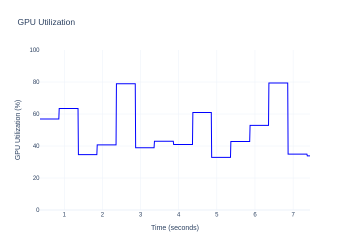
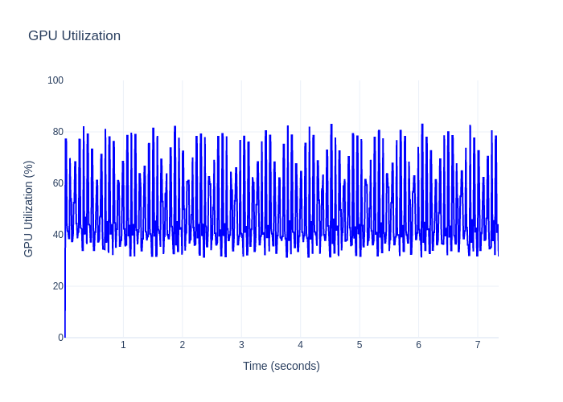

# jtop_fast_gpu_utilization_only

A lightweight Python library for fast GPU utilization monitoring on NVIDIA Jetson devices, reading directly from `/sys/class/devfreq/17000000.gpu/device/load` at high frequencies (up to 100 Hz or more), significantly faster than jtop/jetson_stats's 1 Hz limit.

Using jtop (https://github.com/rbonghi/jetson_stats):


Using this repo (https://github.com/dav-ell/jtop_fast_gpu_utilization_only):


jtop's issues have been well documented:
- https://github.com/rbonghi/jetson_stats/issues/82
- https://github.com/rbonghi/jetson_stats/issues/414
- https://github.com/rbonghi/jetson_stats/issues/73 


## Features
- High-frequency GPU utilization monitoring (default 100 Hz, configurable up to ~1 kHz)
- Thread-safe data collection
- Returns GPU utilization values in the native 0-1000 range
- Statistical analysis of collected data (average, max, standard deviation)
- Simple API for integration into existing projects
- No external dependencies beyond Python standard library

## Installation
```bash
pip install git+https://github.com/dav-ell/jtop_fast_gpu_utilization_only
```

## Usage
```python
from jtop_fast_gpu_utilization_only import FastGPUMonitor
import time

# Initialize monitor with 100 Hz sampling (0.01s interval)
monitor = FastGPUMonitor(interval=0.01)

# Start monitoring
monitor.start()

# Do some GPU work
time.sleep(5)

# Stop monitoring
monitor.stop()

# Get statistics
avg_util, max_util, std_dev, samples = monitor.get_stats()
print(f"Average GPU Utilization: {avg_util:.2f} (0-1000)")
print(f"Max GPU Utilization: {max_util}")
print(f"Standard Deviation: {std_dev:.2f}")
print(f"Number of Samples: {samples}")

# Get raw data
data = monitor.get_data()
for timestamp, util in data[:5]:  # First 5 samples
    print(f"Time {timestamp:.3f}s: {util}")

# Get current utilization without monitoring
current = monitor.get_current_utilization()
print(f"Current GPU Utilization: {current}")
```

## Requirements
- Python 3.6+
- NVIDIA Jetson device with access to `/sys/class/devfreq/17000000.gpu/device/load`
- Linux operating system

## Notes
- Utilization values are returned in the range 0-1000 (native sysfs scale). Divide by 10 to convert to percentage (0-100).
- The minimum practical interval is around 0.001s (1 kHz), though actual frequency may be limited by system I/O performance.
- The library checks for the existence of the GPU load file and logs warnings if it's unavailable.

## License
Apache 2.0

## Contributing
Pull requests are welcome! Please submit issues or feature requests via GitHub.

## Author
dav-ell